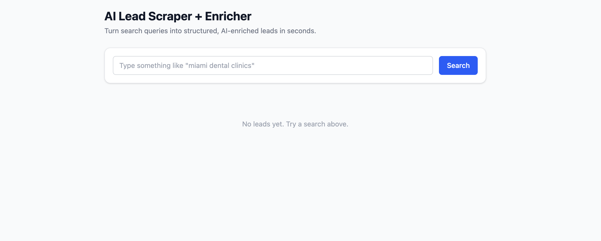
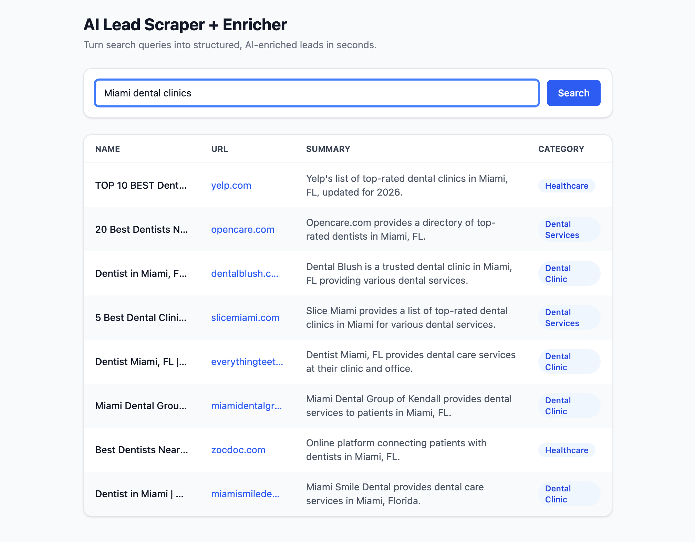
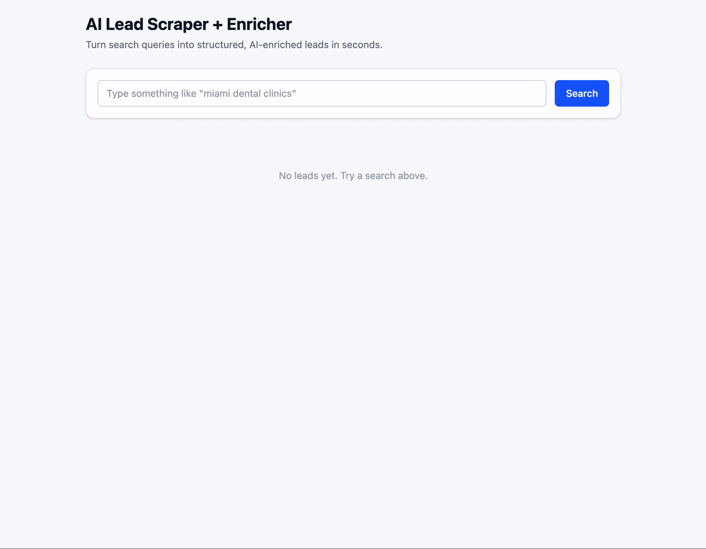

# AI Lead Scraper and Enricher

### Enter a search query and get structured lead data in seconds

Built for teams doing manual prospect research.

Turn search results into structured lead data.

No manual research. No cleanup.

---

## What You Get

- Relevant businesses from any search  
- Short summaries for each result  
- Categories to scan results quickly  
- Structured data ready to use  

---

## Input

Enter a search query.

## Output

Get structured leads with summaries and categories.

## Demo

Watch a search query turn into structured leads in seconds.

---

## Example

**Input**

`miami dental clinics`

**Output**

| Name | Summary | Category |
|------|---------|----------|
| 5 Best Dental Clinics in Miami | Guide listing top clinics | Dental Services |

Each result is structured and ready to review or use.

---

## Why This Matters

No manual research. No tab switching. No cleanup. Get leads you can act on immediately.

---

> This generates leads. The next step is tracking and acting on them.

---

## Built by Guava AI

We build tools like this in 48 to 72 hours.

If your team is doing manual lead research, we can replace it with a system like this.
