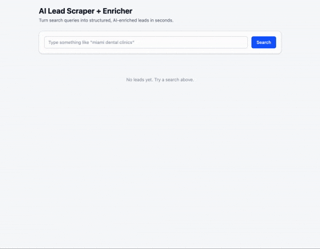

# AI Lead Scraper + Enricher

**Enter a search query and get back clean, AI-enriched leads you can actually use.**

This demo shows how a simple search query can be turned into structured, usable lead data in seconds.

Instead of manually collecting and cleaning results, the process is automated end-to-end.

---

## Demo

Search to structured leads in one flow:



---

## Overview

Finding leads manually is time-consuming, and cleaning that data takes even longer.

This tool takes a simple search query and turns it into structured, usable lead data in one step.

---

## What You Get

For any search, the tool returns:

- **5-10 relevant businesses**
- Short, readable summaries
- Simple categories for quick scanning

All generated in one step, with no manual cleanup required.

---

## Interface


---

## Example

Search: `miami dental clinics`

| Name | Summary | Category |
|------|---------|----------|
| 5 Best Dental Clinics in Miami | Guide listing top clinics | Dental Services |

Each result is cleaned and categorized, ready to review or use immediately.

---

## Why This Matters

Instead of jumping between tabs and cleaning data by hand, you get a structured view of potential leads, ready to act on.

---

## Use Cases

This approach is useful for:

- Building lead lists without manual research
- Quickly scanning markets or competitors
- Turning raw search data into structured datasets
- Automating repetitive research workflows

It can be adapted to different industries and data sources.

---

## Working With This Pattern

This demo is a simple version of a broader pattern.

The same approach can be extended to:
- Custom data sources
- Internal tools and dashboards
- Automated pipelines for research or ops

If you have a workflow that involves repetitive data collection or cleanup, this can likely be automated.

---

## Run Locally (Optional)

```bash
git clone https://github.com/Sebastian-O-Rodriguez/demo-lead-scraper.git
cd demo-lead-scraper
pnpm install
python3 -m venv venv && source venv/bin/activate && pip install -r requirements.txt
```

Create `.env.local`:
```
LEAD_SCRAPER_OPENROUTER_KEY=your_key_here
```

```bash
pnpm dev
```

---

## Tech Stack (Optional)

- Next.js, React, TypeScript
- Python (BeautifulSoup)
- OpenRouter

---

## Note

This is a lightweight demo showing how AI-powered automation can be applied to real workflows.
